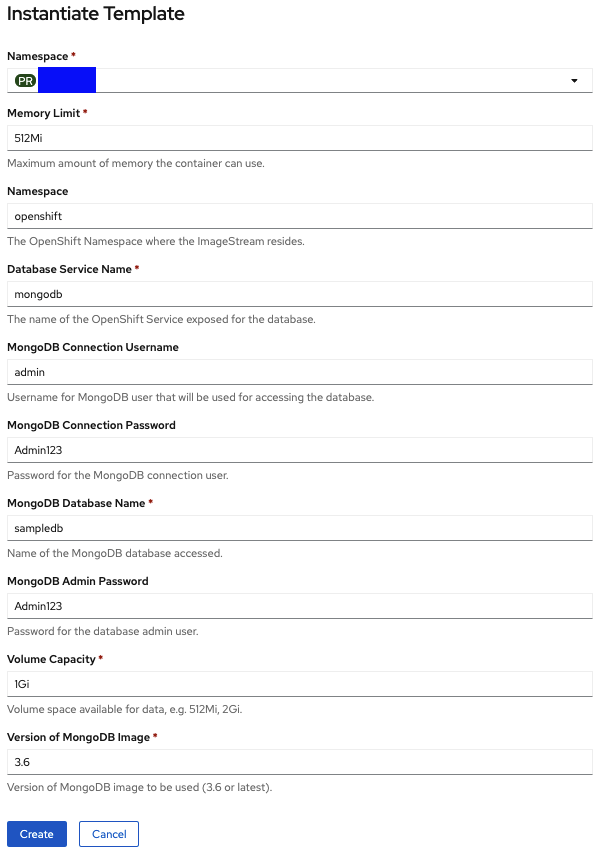
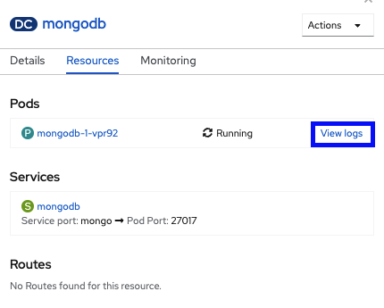
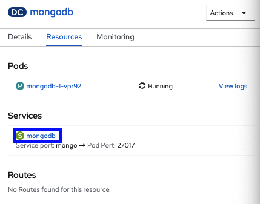
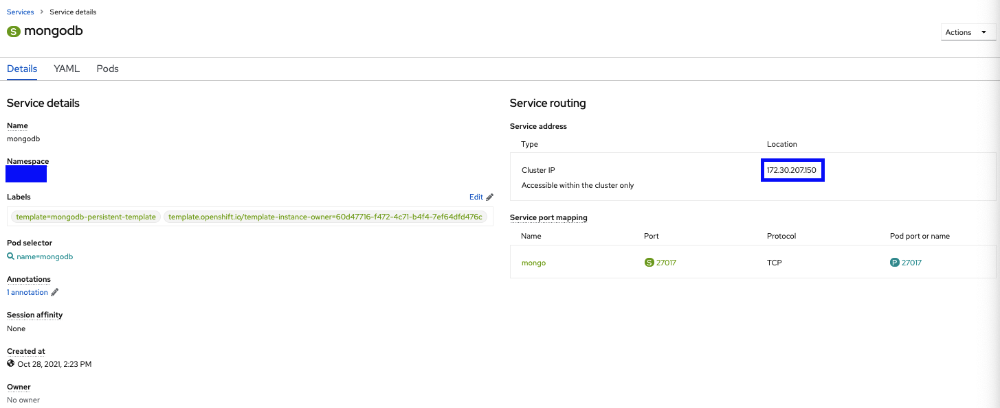
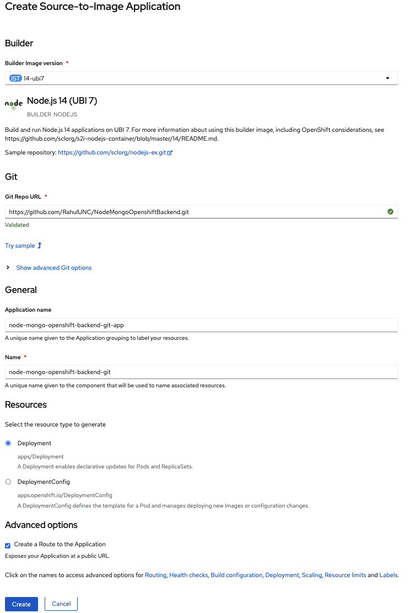
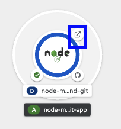

# Deploy an ExpressJS/MongoDB Api on OpenShift
This repo contians starter code to deploy a nodeJS ExpressJS API on Openshit. If followed correctly
you will have CRUD endpoints on collections within MongoDB

## Pre reqs
1. Connected to campus VPN
2. Github Account
3. Sign up for [Carolina Cloud Apps](https://cloudapps.unc.edu/) | This step will only take a second
4. Fork this repo to your github account

## Create a MongoDB database
1. Head to the Topology Tab under the Developer View
2. Select Database from the tiles that appear
3. Select MongoDB from the tiles that appear and hit instanitate template on the modal that opens
4. Accept all default values in the form, for the purpose of this demonstration you can use email and password settings as follows. Please make sure you remember or note these values as you will need them later\

5. Hit create
6. Once the status of the pod shows up as active, head to the resrouce tab, and then hit view logs on the pod, followed by the terminal tab\

7. In the terminal type the follow command
```
mongo -u "admin" -p "Admin123" admin
```
8. If connection is successful you should see this in the terminal
```
MongoDB shell version v3.6.3
connecting to: mongodb://127.0.0.1:27017/admin
MongoDB server version: 3.6.3
Welcome to the MongoDB shell.
For interactive help, type "help".
For more comprehensive documentation, see
        http://docs.mongodb.org/
Questions? Try the support group
        http://groups.google.com/group/mongodb-user
```
9. Go back to the topology and click the mongodb pod, from there hit the mongodb service\

10. Note the IP of the cluster, and update the IP address of the database connection in this repo under config/database.config.js\


## Deploy the ExpressJS app
1. Head to the Topology tab under the Developer view
2. Right click anywhere and select add to project from catalog
3. Search nodeJS and hit the first tile and hit create application
4. Provide the Github repo link of your forked repo, this repo should contain the updated IP of your mongodb database\

5. Hit Create, click on the newly created pod, and wait for the build to finish
6. Visit the endpoint, by clicking the link on the pod\

7. if you have followed all steps correctly you should see the following output in the browser
```
{"welcome":"This is a backend starter api based on an express api connected to mongodb, on the OpenShift container platform"}
```
8. Congratulations your API is now live, modify the routes and model for your use case. Default crud implementations have been provided under app/controllers

## Additional Tools and Tips
1. Download [MongoDB Compass](https://www.mongodb.com/try/download/compass), use this to remotely connect to the DB. You can use the same connection string as in the database config
2. Download the [OpenShift CLI](https://docs.openshift.com/container-platform/4.2/cli_reference/openshift_cli/getting-started-cli.html), can be used to emulate pods and route ports for local testing
3. Heres how to remotely connect to MongoDB over localhost
```
oc get pods
```
This will return output like
```
NAME                     READY     STATUS       RESTARTS   AGE
mongodb-1-XXXXX          1/1       Running      0          12h
my-node-app-10-build     0/1       Completed    0          10h
```
Grab the pod name from the output. From here you can remote sh using the following command 
```
oc rsh mongodb-1-XXXXX
```
To connect to mongodb via local host setup port forward, this will allow you to send traffic to mongodb
over localhost:34000. You can also replace the ip in the database config with localhost:34000 to test 
connections locally
```
oc port-forward mongodb-1-XXXXX 34000:27017
```
